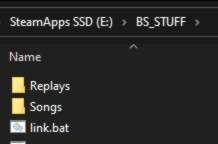
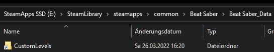

# Reusing the same Songs / Replays / Playlists and whatnot folders for multiple versions

---

Tend to switch between multiple versions and dont want to move or copy around your Songs etc? Fear not, thanks to ✨ Symlinks 🌟

1. Create a Folder somewhere outside of your game install ***on the same drive as the game***
2. Move the folders of things that you want to reuse across all installs into this folder

3. Create / Save [The Script](linkscript.bat) which links these folders in place of where they should be in the game install. For this example, the game is installed in `E:/SteamApps/common/Beat Saber` and the things I want to reuse are in `E:/BS_STUFF`. Ideally you probably want to save it alongside the fildes which you are linking.

4. Success!

As far as Applications are concerned, Directory Junctions (Which is what this script creates) are the same as a folder which would be at that location, so newly downloaded songs will go into your linked folder etc.

Keep in mind that if you were to copy the Beat Saber folder, ***the created links will turn into empty folders***. So what I do when updating is renaming my working install folder, copying that back to the default Beat Saber folder name, and then verifying game integrity so that the old install stays "intact" / properly linked.